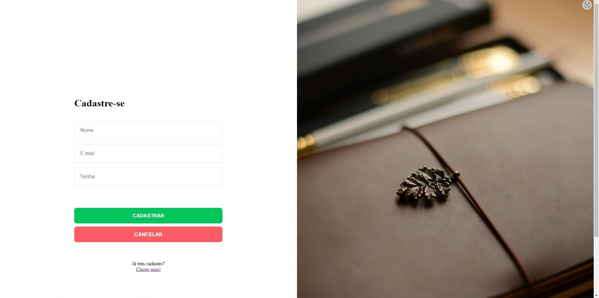
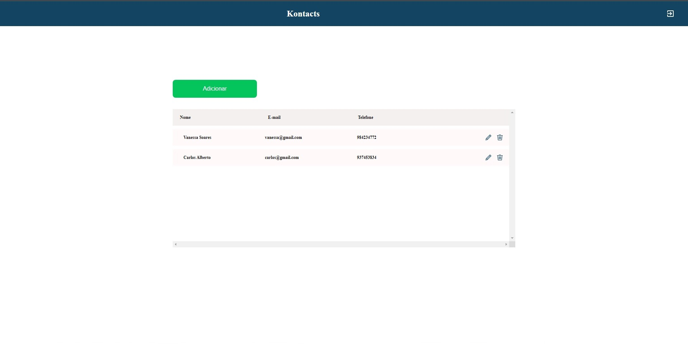
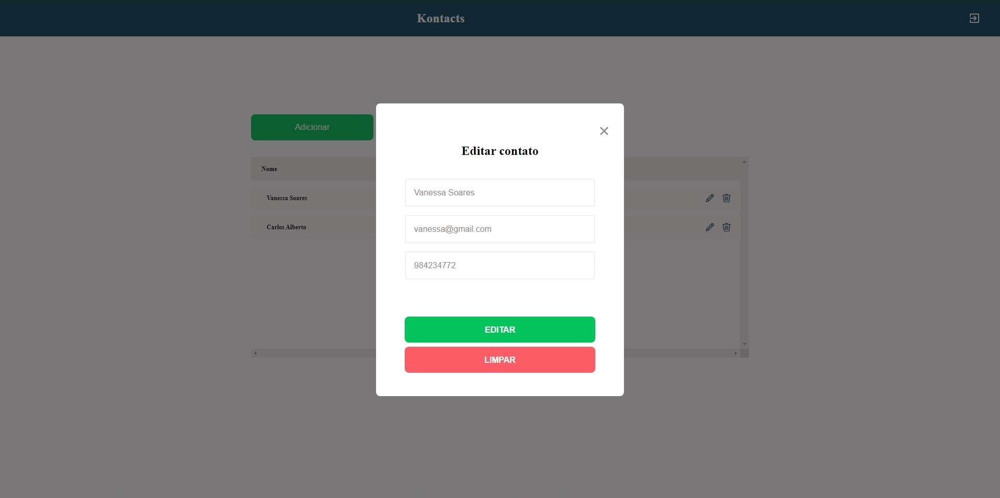
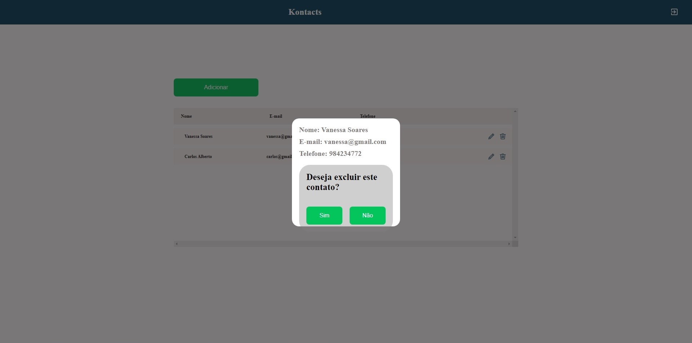

# Kontacts-App
- Front-end para o aplicativo "Kontacts".

### Link para testar online: https://kontacts-web-app.netlify.app

OBS: A aplicação está bem básica, sem muitas validações. Em um futuro breve a aplicação será melhorada.

## Descrição do projeto:
- O projeto consiste em um simples sistema que permite a criação e alteração de uma lista de contatos, com sistema de cadastro e login.

- Repositório de back-end: https://github.com/PatrickOtero/Kontacts-API

## Caso prefira testar localmente:
     1° - Baixe a engine (motor) que interpretará as funcionalidades das dependências em javascript, o Node, através deste link: https://nodejs.org/en/download/
     2° - Selecione o instalador de acordo com o seu sistema operacional e arquitetura (32-bit ou 64-bit)
     3° - Ao abrir o instalador do Node, pressione o botão "next" até aparecer a opção de instalar um software chamado "Chocolatey". Não instale ele e prossiga até o final.
     4° - Clone este repositório para o seu computador, vá até a pasta clonada e execute seu terminal na mesma.
     5° - Execute o comando no diretório raíz (onde está localizada a pasta "src"): "npm i".
     6° - Espere o interpretador instalar todos os arquivos necessários para rodar o projeto.
     7° - Execute o comando no mesmo local: "npm start"
     8° - Aguarde a abertura do projeto em seu navegador padrão.

## Página de login 

## Página de cadastro

## Página home 

## Modal de adição de contato

## Modal de edição de contato 

## Modal de deleção de contato

### Obrigado pela boa vontade.
